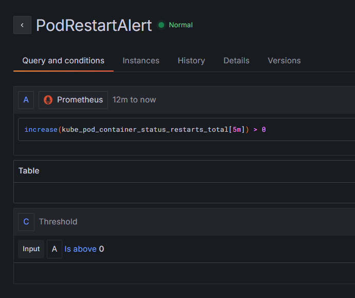
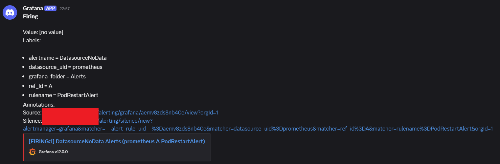
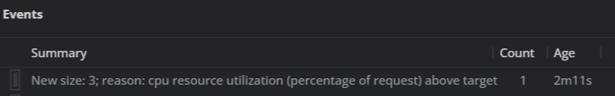
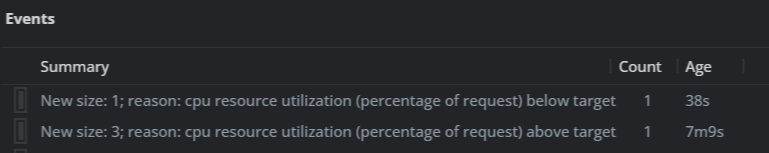

# Google Kubernetes Engine (GKE) Demo

This guide provides step-by-step instructions for creating a Kubernetes cluster on Google Cloud Platform (GCP) using Terraform, deploying an application, and setting up Horizontal Pod Autoscaler (HPA) with Prometheus and Grafana for monitoring. Also Istio for service mesh.

## Prerequisites

- A Google Cloud Platform (GCP) account.
- Google Cloud SDK installed on your local machine.
- Terraform installed on your local machine.
- Helm installed on your local machine.
- kubectl installed on your local machine.

## GKE Cluster Creation

```bash
# GCP login and project setup
gcloud auth application-default login
gcloud config set project <GCP_PROJECT_ID>

cd terraform

terraform init
terraform plan -var="project_id=<GCP_PROJECT_ID>"
terraform apply -var="project_id=<GCP_PROJECT_ID>"

# Run the following command to get the kubeconfig for your GKE cluster
# For Lens check here: https://github.com/lensapp/lens/issues/6563#issuecomment-1402048045
gcloud container clusters get-credentials my-cluster --region europe-west1 --project <GCP_PROJECT_ID>

# Test the connection to your GKE cluster
kubectl get nodes
```

## Deployment Commands

```bash
kubectl apply -f kubernetes/app-deployment.yaml

# Check the status of the deployment
kubectl get pods -o wide
kubectl get svc test-app-service
```

## HPA Installation

```bash
kubectl apply -f kubernetes/app-hpa.yaml

# Check the status of the HPA
kubectl get hpa test-app-hpa
```

## Prometheus ve Grafana Installation

```bash
# Add Helm repository and update
helm repo add prometheus-community https://prometheus-community.github.io/helm-charts
helm repo update

# Create a namespace for monitoring
kubectl create namespace monitoring

# kube-prometheus-stack installation
# Note: Since logging/monitoring is disabled in GKE, metrics will be collected without problems.
# If GKE's own monitoring was enabled, some settings might be needed to avoid conflicts.
helm install prometheus prometheus-community/kube-prometheus-stack --namespace monitoring \
  --set prometheus.prometheusSpec.serviceMonitorSelectorNilUsesHelmValues=false \
  --set prometheus.prometheusSpec.podMonitorSelectorNilUsesHelmValues=false
  --set grafana.adminPassword='<YOUR_PASSWORD>' # Grafana admin password

# Check the status of Prometheus and Grafana pods
kubectl get pods -n monitoring
```

### Alert

That sends a message to Discord for pods that have restarted in the last 5 minutes.





## Istio Installation

```bash
cd helm/istio

helm repo add istio https://istio-release.storage.googleapis.com/charts
helm repo update

kubectl create namespace istio-system

helm upgrade --install istio-base istio/base --namespace istio-system -f base-values.yaml
helm upgrade --install istiod istio/istiod --namespace istio-system -f istiod-values.yaml
helm upgrade --install istio-ingress istio/gateway --namespace istio-system -f ingress-values.yaml
helm upgrade --install istio-egress istio/gateway --namespace istio-system -f egress-values.yaml

# sidecar injection (https://istio.io/latest/docs/setup/additional-setup/sidecar-injection)
kubectl label namespace default istio-injection=enabled --overwrite
# For Sidecar proxies to be injected, we need to restart the pods.
kubectl delete pod -l app=test-app -n default
```

To expose our application to external traffic using Istio Ingress Gateway, we'll need to create an Istio Gateway and a VirtualService.

- I have wildcard tls secret for my domain. I recommend same for you too.

```bash
kubectl apply -f kubernetes/istio-config.yaml
```

## Load Test

```bash
# Load test to trigger HPA
kubectl run -i --tty load-generator --rm --image=busybox --restart=Never -- /bin/sh -c "while sleep 0.01; do wget -q -O- https://<EXTERNAL_IP_OR_DOMAIN>; done"
```

After load test, scaled to 3 replicas from 1.



[5 minutes](./kubernetes/app-hpa.yaml?plain=1#L21) after CPU utilization back to normal:



## Cleanup (Optional)

```bash
# Delete the GKE cluster and Terraform resources
cd terraform
terraform destroy -var="project_id=<GCP_PROJECT_ID>"
```

```bash
# Delete the application deployment and HPA
kubectl delete -f kubernetes/app-deployment.yaml
kubectl delete -f kubernetes/app-hpa.yaml
# Delete Prometheus and Grafana
helm uninstall prometheus -n monitoring
# Delete the monitoring namespace
kubectl delete namespace monitoring


# If you don't need the cluster, you can destroy your entire environment just by running this command.
# Delete the GKE cluster
gcloud container clusters delete my-cluster --region europe-west1 --project <GCP_PROJECT_ID>
```
